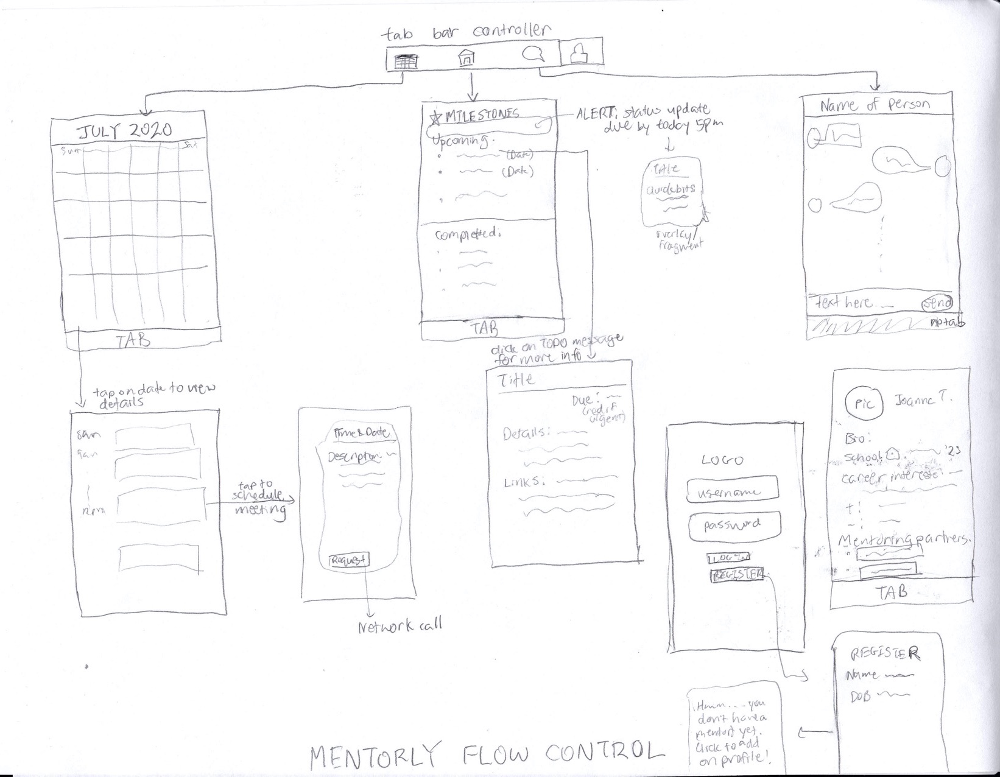
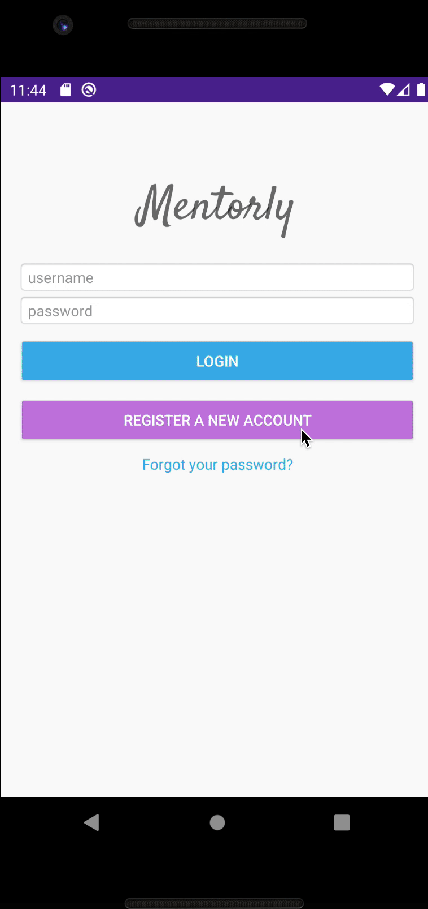

# Mentorly

## Table of Contents
1. [Overview](#Overview)
1. [Product Spec](#Product-Spec)
1. [Wireframes](#Wireframes)
1. [Walkthroughs](#Walkthroughs)

## Overview
### Description
Integrated platform for building and sustaining 1:1 mentoring relationships.

### App Evaluation
- **Category:** Productivity/Social Networking
- **Mobile:** This app would be primarily developed for mobile but would perhaps be just as viable on a computer. A website version could potentially have more display room but the mobile version will be focused on ease of use and accesibility to information on-the-go.
- **Story:** Mentors and mentees can choose to connect with each other on the platform, and the app will be streamlined in presenting critical info to both the mentor/mentee. Scheduling meetings, sharing and filing resources, and chat will be the main features.
- **Market:** Any individual could choose to use this app, and it would be especially useful for anyone looking for career development opportunities. Many organizations that offer mentoring partnerships could use this app.
- **Habit:** This app could be used as frequent or infrequent depending upon the mentor/mentee relationship. Since the goal of the app is to sustain these mentoring relationships, the app could send push notifications on a weekly/biweekly basis to both parties if there's a lack of interaction with the app.
- **Scope:** V1 would include building the mentor/mentee interface: an overall To Do list, chat feature, and ability to view each other's schedules. V2 could build upon these features by scheduling recurring meetings and implementing an organized resources tab for outside links being referenced in the mentoring. V3 would incorporate mentor and mentee-facing interfaces. V4 might incorporate a video call option or external SDK for choosing meetup spots. 

## Product Spec
### 1. User Stories (Required and Optional)

**Required Must-have Stories**

* User can login and register (backed by Parse backend)
* User can add a profile picture using camera
* User can view upcoming/completed tasks, ToDo view of mentoring relationship
* Ability to add other users as a mentor/mentee and view a history of their interactions
* User can view their mentor/mentee's schedule and request a meeting (Google Calendar SDK)
   * Use OAuth login to send requests to Calendar API
* Mentor/mentee exclusive chat window
* Algorithm to suggest a potential meeting time
* Bottom navigation for switching between chat/calendar/ToDo view
* Animation on ToDo items or chat messages
* Double tap gesture recognition on ToDo or message (likes)

**Optional Nice-to-have Stories**

* Different facing interfaces for mentor/mentee
    * Mentor can add ToDo items, mentee can check off ToDo items
* Ability for mentor to request status updates & ability for mentee to upload status updates (pictures optional)
* Organized resources tab (think bookmarks/Slack channels)
    * Add material design e.g. cards for each resource
* Integrate meet-up function into the app
    * Virtual video or phone call
    * In-person meet up spots (Yelp SDK)
* Ability to add several users as mentors/mentees, and access these on a profile or settings tab
* Profile tab: view profile picture and basic bio like current work/education; history of mentorship
* (Stretch) offline availability

### 2. Screen Archetypes

* Login
   * User can login to account or register for an account
   * Upon Download/Reopening of the application, the user is prompted to log in to gain access to their profile information and to input the user id of their mentor/mentee match
* Messaging Screen - Chat for users to communicate (direct 1-on-1)
   * Upon inputting mentor/mentee match, a 1:1 chat interface is creatd
* To Do - Overview of milestones
   * Ability to view progress trackers of mentoring relationship
* Calendar
    * View each other's schedules and ability to request a meeting
* Profile Screen
    * Allows users to upload a profile picture, change their name, add common info

### 3. Navigation

**Tab Navigation** (Tab to Screen)

* To Do
* Chat
* Calendar

Optional:
* Resources
* Profile

**Flow Navigation** (Screen to Screen)

* Forced log-in -> Account creation if no log in is available
    * Log in -> To Do view
* Mentor/Mentee username input -> 1:1 chat 
* Calendar -> View for scheduling a meeting

## Wireframes

## Schema 

### Models
#### ToDo Item

   | Property      | Type     | Description |
   | ------------- | -------- | ------------|
   | objectId      | String   | unique id for the to-do item (default field) |
   | author        | Pointer to User| item author |
   | title        | String | summary of the to-do item|
   | description       | String   | more info on the item (optional) |
   | comments (stretch) | Array (Strings/Pointers)  | ability to add updates on a ToDo item |
   | createdAt     | DateTime | date when post is created (default field) |
   | updatedAt     | DateTime | date when post is last updated (default field) |
   
#### User

   | Property      | Type     | Description |
   | ------------- | -------- | ------------|
   | objectId      | String   | unique id for the to-do item (default field) |
   | username        | String | username for the user |
   | partner        | Pointer to User | pointer to the user's mentoring match
   | partners (stretch) | Array (Pointers)   | view all mentoring matches |
   | profilePic| File  | user's profile picture |

### Networking
#### List of network requests by screen
   - ToDo List Screen
      - (Read/GET) Query all to-do items
      - (Create/POST) Create a new to-do item
      - (Update/PUT) Mark to-do item as completed
   - Create Post Screen
      - (Create/POST) Create a new post object
   - Profile Screen
      - (Read/GET) Query logged in user object
      - (Update/PUT) Update user profile image
      
#### [OPTIONAL] Existing API Endpoints
##### Google Calendar
- Base URL - https://www.googleapis.com/calendar/v3/calendars
- https://www.googleapis.com/auth/calendar

   HTTP Verb | Endpoint | Description
   ----------|----------|------------
    `GET`    | /calendarId/events | get all events, input calendar ID
    `GET`    | /calendarId/events/eventId | return specific event by ID
    `PUT`    | /calendarId/events/eventId | update specific event by ID
    `POST`    | calendarId/events/quickAdd   | use a String to add an event
    `POST`    | /calendarId/events  | add a new event to the calendar
    `GET`    | /users/me/calendarList/calendarId  | retrieve all calendars for the current user
    
## Walkthroughs

